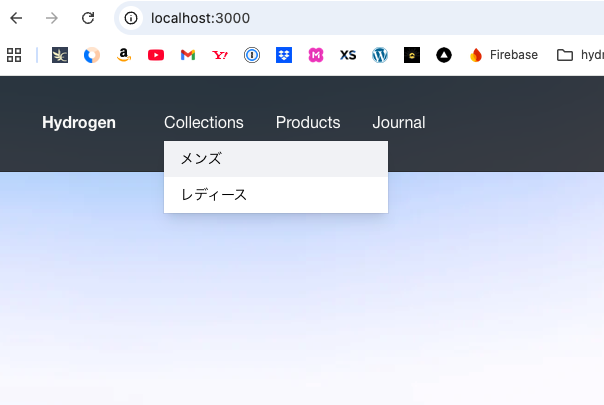

# Hydrogen template: Demo Store

Hydrogen is Shopify’s stack for headless commerce. Hydrogen is designed to dovetail with [Remix](https://remix.run/), Shopify’s full stack web framework. This template contains a **full-featured setup** of components, queries and tooling to get started with Hydrogen. It is deployed at [hydrogen.shop](https://hydrogen.shop)

[Check out Hydrogen docs](https://shopify.dev/custom-storefronts/hydrogen)
[Get familiar with Remix](https://remix.run/docs/en/v1)

## What's included

- Remix
- Hydrogen
- Oxygen
- Shopify CLI
- ESLint
- Prettier
- GraphQL generator
- TypeScript and JavaScript flavors
- Tailwind CSS (via PostCSS)
- Full-featured setup of components and routes

## Getting started

**Requirements:**

- Node.js version 18.0.0 or higher

```bash
npm create @shopify/hydrogen@latest -- --template demo-store
```

Remember to update `.env` with your shop's domain and Storefront API token!

## Building for production

```bash
npm run build
```

## Local development

```bash
npm run dev
```

## Setup for using Customer Account API (`/account` section)

### Setup public domain using ngrok

1. Setup a [ngrok](https://ngrok.com/) account and add a permanent domain (ie. `https://<your-ngrok-domain>.app`).
1. Install the [ngrok CLI](https://ngrok.com/download) to use in terminal
1. Start ngrok using `ngrok http --domain=<your-ngrok-domain>.app 3000`

### Include public domain in Customer Account API settings

1. Go to your Shopify admin => `Hydrogen` or `Headless` app/channel => Customer Account API => Application setup
1. Edit `Callback URI(s)` to include `https://<your-ngrok-domain>.app/account/authorize`
1. Edit `Javascript origin(s)` to include your public domain `https://<your-ngrok-domain>.app` or keep it blank
1. Edit `Logout URI` to include your public domain `https://<your-ngrok-domain>.app` or keep it blank

## 開発記録 (Development Log)

### 目標
HydrogenのデモテンプレートからリッチなHeaderを作成する

### 進捗

#### 2025-8-27: プロジェクト初期化
- Headless UI対応のvite.config.ts設定
- GitHub Actions無効化
- 開発環境構築完了

#### 2024-8-28: ドロップダウンメニューテスト実装
- PageLayout.tsx内のDesktopHeaderにHeadless UI導入
- CollectionsメニューをMenuコンポーネントで実装
- メンズ・レディースサブメニュー追加




### 次回予定
- モバイル対応ドロップダウン実装
- アニメーション・スタイリング強化

### 学習メモ
- Headless UI = 機能のみ、見た目はCSS/Tailwindで実装
- Hydrogenの既存コンポーネント構造の理解が重要